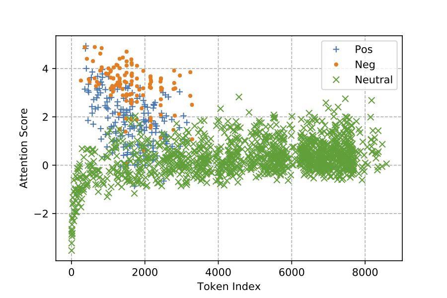

# Understanding Attention for Text Classification
This is the supplementary materials and Pytorch code for the paper Understanding Attention for Text Classification.

 

Attention has been proven successful in many
natural language processing (NLP) tasks. Re-
cently, many researchers started to investigate
the interpretability of attention on NLP tasks.
Many existing approaches focused on examin-
ing whether the local attention weights could
reflect the importance of input representations.
In this work, we present a study on under-
standing the internal mechanism of attention
by looking into the gradient update process,
checking its behavior when approaching a lo-
cal minimum during training. We propose to
analyze for each word token the following two
quantities: its polarity score and its attention
score, where the latter is a global assessment
on the token’s significance. We discuss con-
ditions under which the attention mechanism
may become more (or less) interpretable, and
show how the interplay between the two quan-
tities may impact the model performance

## Requirements
* Python version >= 3.6
* Pytorch version >= 1.1

## Data
* SST
* IMDB
* 20News I
* 20News II

