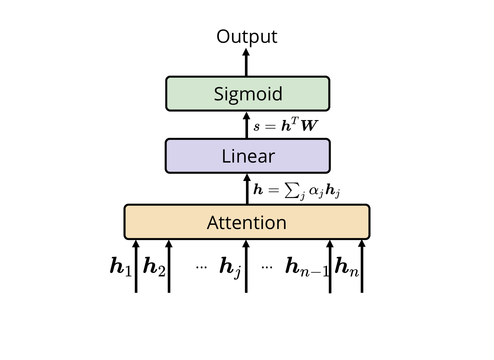

# Understanding Attention for Text Classification
This is the supplementary materials and Pytorch code for the paper Understanding Attention for Text Classification.

 

Attention has been proven successful in many natural language processing (NLP) tasks. Re- cently, many researchers started to investi- gate the interpretability of attention on NLP tasks. Existing approaches focused on examin- ing whether the local attention weights could reflect the importance of input representations. In this work, we present a study on under- standing the internal mechanism of attention by looking into the gradient update process, checking its behavior when approaching a lo- cal minimum during training. Based on the analysis and empirical results on the text clas- sification task, we found that the polarity of a word token – the degree of association be- tween a token and a class label may impact the attention scores, a global assessment on the significance of a token.

## Requirements
* Python version >= 3.6
* Pytorch version >= 1.1

## Data
* SST
* IMDB
* 20News I
* 20News II

